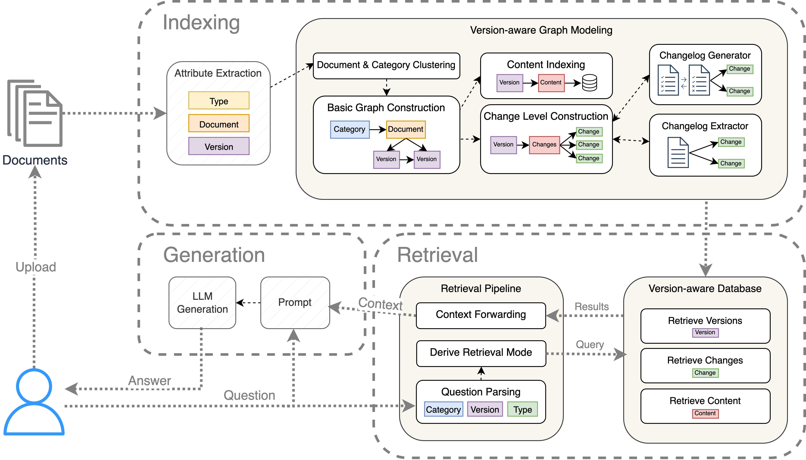
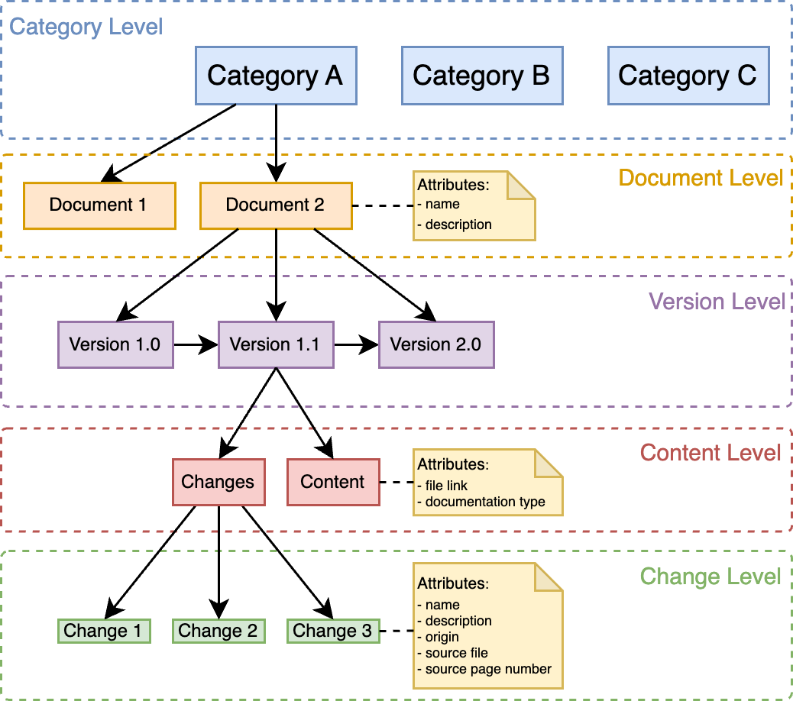

# VDocRAG – Prototype Implementation

This repository contains a prototype implementation of **VDocRAG (Versioned Document Retrieval-Augmented Generation)** — a retrieval-augmented question answering system designed to handle **versioned document collections**. The project was developed for academic purposes as part of a bachelor's thesis.

> ⚠️ **Prototype Notice**  
> This project is a **research prototype** developed for academic evaluation purposes only.  
> It is not optimized for production use, and the implementation prioritizes clarity and experimentation over code quality or performance.

## Overview

**VDocRAG** is a retrieval-augmented generation (RAG) pipeline developed specifically for working with **versioned document collections**. It supports version-aware retrieval and reasoning by explicitly modeling:

- document and version metadata,
- changes across document states (e.g., additions, deprecations),
- and a version-sensitive graph structure.

The core idea is to build a **version graph** during indexing, capturing relationships between document versions and tracking their evolution. During retrieval, VDocRAG uses a hybrid strategy: depending on the query type, it either leverages the graph structure directly (e.g., for change reasoning), or performs vector-based content retrieval with version constraints applied via the graph.

In contrast to standard RAG or GraphRAG, VDocRAG is designed to **maintain temporal alignment and version specificity**, making it suitable for scenarios that require high precision across evolving documentation.

For benchmarking purposes, the repository also includes independent implementations of:

- **Naive RAG** (baseline with standard dense retrieval),
- **GraphRAG** (retrieval via knowledge graph).

These implementations are included solely for performance comparison and are not part of the VDocRAG system.




*Figure: High-level architecture of the VDocRAG system. The indexing phase builds a version-aware graph; the retrieval phase selects the appropriate retrieval strategy based on the question context.*



*Figure: Conceptual structure of the version-aware document graph. Nodes represent categories, documents, versions, content, and tracked changes.*

## Features

## ✅ VDocRAG Features

- **Multi-document support**  
  Handles multiple versioned documents across different categories, automatically distinguishing between standard documents and changelogs. Indexing is fully automated with no manual intervention required.

- **Version-aware graph construction**  
  Builds a structured graph representing documents, versions, and occured changes between subsequent versions.

- **Change tracking**  
  Detects and links additions, removals, and deprecations across document versions.

- **Version metadata indexing**  
  Extracts and stores version-specific metadata for targeted retrieval.

- **Targeted retrieval capabilities**  
  - Retrieve content for a specific document version  
  - List available document versions  
  - Identify tracked changes between two versions

- **LLM integration**  
  Supports dynamic configuration of the underlying language model used for generation.

- **Baseline implementations included**  
  Includes reference implementations of standard (naive) RAG and GraphRAG for performance comparison.

## Getting Started

### Installation

Install dependencies listed in `src/requirements.txt`:

```bash
pip install -r src/requirements.txt
```

### Running the Program

Switch into the src/ directory and run the main program:
```bash
cd src
python main.py
```

## 🔐 Configuration

To run the system, a `.env` file must be placed in the `src/` directory to provide necessary credentials for external services.

### Required environment variables:

#### 🔑 LLM API keys
- `OPENAI_API_KEY` – for OpenAI-based language models
- `GROQ_API_KEY` – for Groq-based language models

> ⚙️ The selection of which LLMs are used is configured in `src/util/constants.py`.

#### 🛠️ Local vector database (Neo4j)
- `NEO4J_URI`  
- `NEO4J_USER`  
- `NEO4J_PASSWORD`  

#### ☁️ Cloud-based vector database (Neo4j Aura)
- `NEO4J_URI_AURA`  
- `NEO4J_USERNAME_AURA`  
- `NEO4J_PASSWORD_AURA`  
- `AURA_INSTANCEID`  

> ⚠️ Make sure to never commit your `.env` file to version control.